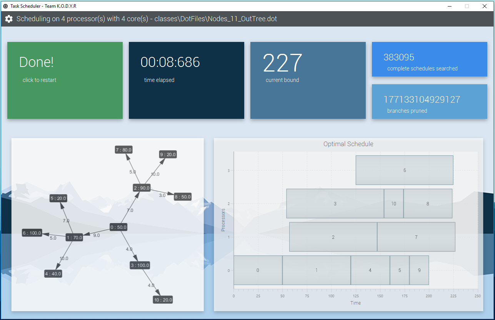

# Team K.O.D.Y.R Task Scheduler


## Contributors
Name: Yianni Bares,		Username: ybar417,  ID: 533468329,  GitHub name: yianni1

Name: Raymond Young,  Username: ryou681,  ID: 564122195,  GitHub name: rayyoung122

Name: Kevin Manson,   Username: kman756,  ID: 978326868,  GitHub name: kevinalexandermanson

Name: Dweep Kapadia,  Username: dkap813,  ID: 559875934,  GitHub name: Cy3b3rZ3r0 & DweeDog

Name: Oliver Li,      Username: mli730,   ID: 939043857,  GitHub name: nolatos


## Installation and Running

Download the scheduler.jar, then place it in a desired directory. This program is designed to be run from the command line from a Linux machine, though it is platform-independent.

In order to run the program, place the input .dot file into the same directory as the jar. Then navigate into the directory from the terminal, and type in the following command:

```
java -jar [JAR-NAME].jar [INPUT-NAME].dot [NUMBER]
```
- [JAR-NAME] is the name of the jar
- [INPUT-NAME] is the name of the input file
- [NUMBER] is the number of processors you wish to schedule tasks on 
The output file should then be generated in the same directory as the jar. Please make sure the format of your input is correct.

## Options

It's possible to change the way the program runs via a number of options available. Any combination of these options may be used.
- The -o option allows the user to specify the name of the output file. This defaults to [INPUT-NAME]-output.dot if this option is not selected.
- The -v option will display a GUI visualisation is selected.
- The -p option allows the user to specify the number of 'cores' (or threads) to run the program on. This defaults to 1 if this option is not selected.

They should be used as such:

```
java -jar [JAR-NAME].jar [INPUT-NAME].dot [NUMBER] -o [DESIRED-OUTPUT-NAME] -p [NUMBER-OF-CORES] -v
```
where [DESIRED-OUTPUT-NAME] is name you wish the output file to be stored as. The output file generated will have the name [DESIRED-OUTPUT-NAME].dot.

An example use would be:

```
java -jar program.jar sample-input.dot 3 -o NEW_OUTPUT -p 2 -v
```
which will schedule tasks on 3 processors, create a file called NEW_OUTPUT.dot, run on 2 cores, and display a visualisation.

## External Libraries

Apache Commons CLI for command line parsing (The Apache Software License - Version 2.0)

GraphStream for .dot file processing and visualisation (LGPL V3)

JavaFX & jFoenix for GUI (The Apache Software License - Version 2.0)


